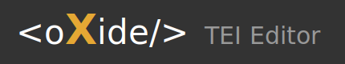

<picture>
  <source media="(prefers-color-scheme: dark)" srcset="imgs/logo-oxygen-style-transparent.svg">
  
</picture>

[](LICENSE)
[](https://github.com/naspatterns/oXide_TEI_Editor/actions)

## About

oXide is a browser-based XML editor designed for encoding documents according to the [TEI (Text Encoding Initiative)](https://tei-c.org/) guidelines. It supports the full TEI P5 specification with 588 elements (TEI All) as well as the curated TEI Lite subset with 106 elements. Users can also load custom RelaxNG schemas for specialized encoding projects.

The editor was developed to provide digital humanities researchers with a free, accessible alternative to commercial XML editors. It runs entirely in the browser with no server-side dependencies, supports offline use through PWA technology, and can be installed as a standalone application on desktop or mobile devices.

**[Live Demo](https://naspatterns.github.io/oXide_TEI_Editor/)**

## Features

- Schema-aware autocompletion based on cursor context
- Real-time XML validation with inline error markers
- Multi-tab document editing
- XML outline tree with click-to-navigate
- TEI to HTML preview
- Opening/closing tag synchronization
- Dark and light themes
- PWA support for offline use

## Quick Start

The easiest way to try oXide is the online demo — no installation required:

**https://naspatterns.github.io/oXide_TEI_Editor/**

To run locally:

```bash
git clone https://github.com/naspatterns/oXide_TEI_Editor.git
cd oXide_TEI_Editor
npm install
npm run dev
```

## Tech Stack

| Layer | Technology |
|-------|------------|
| UI | React 18, TypeScript |
| Editor | CodeMirror 6 |
| Build | Vite 6 |
| Test | Vitest |

## Scripts

| Command | Description |
|---------|-------------|
| `npm run dev` | Development server |
| `npm run build` | Production build |
| `npm run test:run` | Run tests |

## Browser Support

| Browser | Directory Picker |
|---------|------------------|
| Chrome/Edge | Supported |
| Firefox/Safari | Single files only |

## Schema Support

| Schema | Elements | Description |
|--------|----------|-------------|
| TEI Lite | 106 | Curated subset |
| TEI All | 588 | Full TEI P5 |
| Custom RNG | User-defined | Upload .rng file |

> **Note:** Custom RNG schemas must be TEI conformant. Non-TEI schemas (e.g., DocBook, DITA) are not supported by the validator.

## Contact

For questions or bug reports, email hyoungseok.ham@gmail.com.

## License

GPL-3.0. See [LICENSE](LICENSE).
